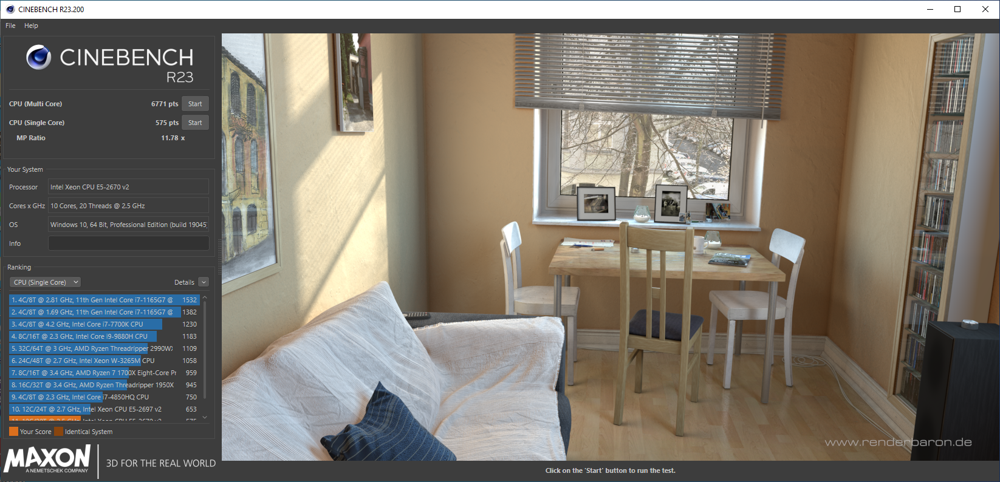
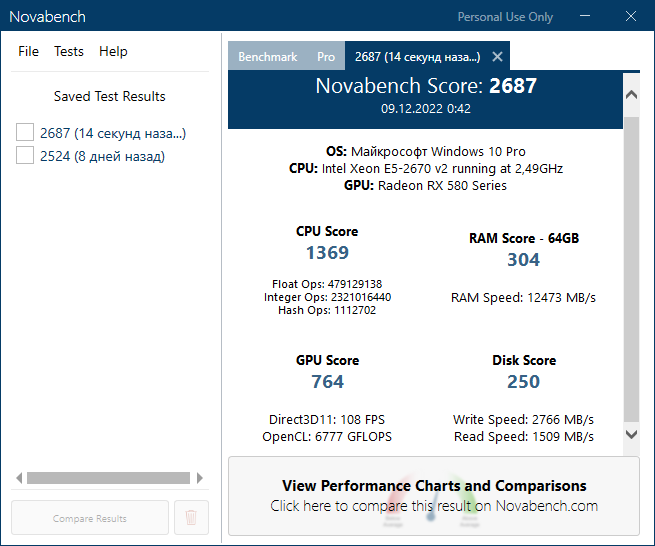
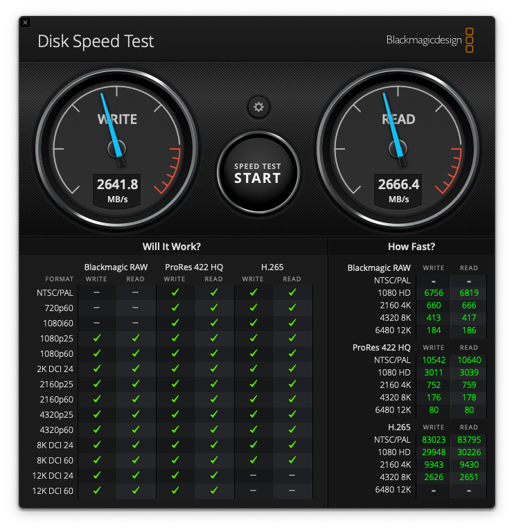

## Результаты тестов в бенчмарках

Вообще информацию о всех существующих бенчмарках для macOS можно посмотреть например тут https://applelife.ru/threads/benchmarki-dlja-macos-benchmarks.2971453/

В Windows 10 тесты проводились, когда она была запущена из меню BIOS/UEFI

### Результаты на Windows 10

#### Geekbench

- https://browser.geekbench.com/v5/cpu/19176185
- https://browser.geekbench.com/v5/compute/6035892

#### Cinebench

#### Unigine Heaven

#### Novabench

#### CrystalDiskMark

#### AJA System Test Lite

#### ATTO Disk Benchmark

#### AIDA64 Cache & Memory Benchmark

---

### Результаты на macOS Monterey

#### Geekbench

- https://browser.geekbench.com/v5/cpu/18965073
- https://browser.geekbench.com/v5/compute/5976855
- https://browser.geekbench.com/v5/compute/5976862

#### Cinebench

#### Unigine Heaven

#### Novabench

#### Blackmagic Disk Speed Test

#### AmorphousDiskMark

#### AJA System Test Lite

#### ATTO Disk Benchmark

#### AmorphousMemoryMark

#### PerformanceTest

https://www.passmark.com/baselines/V10/display.php?id=502703847240

#### Intel Power Gadget

---

### Результаты на macOS Mojave

#### Geekbench

- https://browser.geekbench.com/v5/cpu/18969950
- https://browser.geekbench.com/v5/compute/5978329
- https://browser.geekbench.com/v5/compute/5978335

#### Cinebench

#### Unigine Heaven

#### Novabench

#### Blackmagic Disk Speed Test

#### AmorphousDiskMark

#### AJA System Test Lite

#### ATTO Disk Benchmark

#### AmorphousMemoryMark

#### Intel Power Gadget

